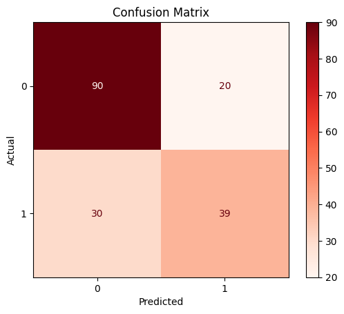

# kaggleのtitanicのデータ分析を行った。

# 分析(工夫)の流れ
# 1.ベースライン作成
## 1-1.データセットの分割
FareとPclassを特徴量に指定して、データセットを分割。
この時、trainとvalで生存者の比率を同じになるようにした。

## 1-2.LightGBMを使用
### 精度
Train Accuracy: 0.7669
Validation Accuracy: 0.7207

### 1-3.特徴量の重要度
col	imp
0	Fare	1013.661127
1	Pclass	474.618153

### 1-4.confusion matrix

