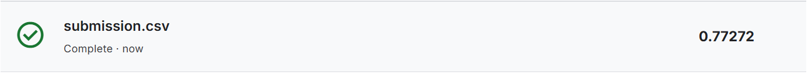

# kaggleのtitanic分析

# 分析の流れ
## 1.ベースライン作成
## 1-1.データセットの分割
FareとPclassを特徴量に指定して、データセットを分割。
この時、trainとvalで生存者の比率を同じになるようにした。

## 1-2.LightGBMを使用
### 精度
Train Accuracy: 0.7669
Validation Accuracy: 0.7207

### 1-3.特徴量の重要度

### 1-4.confusion matrix

### 1-5.予測の確率表示

### 1-6.ベースモデルのテスト結果

## 2.特徴量エンジニアリング
性別を0,1のラベルに変換し、学習に使用
性別、運賃、年齢、SiBSp(兄弟姉妹、配偶者の数)+Parch(親、子供の数)を特徴量に使用
SibSpとParchを新たな特徴量とした理由は、乗船時に身内が少ないと救助されづらく、多すぎても非難が遅れるのでは？と予測したため。

特徴量エンジニアリングの結果

今後はパラメータチューニングなども行い、更なる精度向上を目指しています。

